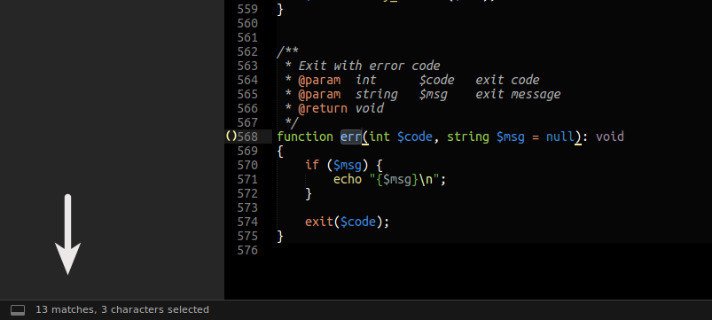

# SublimeTextMatchCounter

A simple plugin to auto count selected text in sublime text.



## How to install

Go to Preferences -> Browse Packages\
Open terminal at that directory\
run: ```git clone https://github.com/melbahja/SublimeTextMatchCounter```